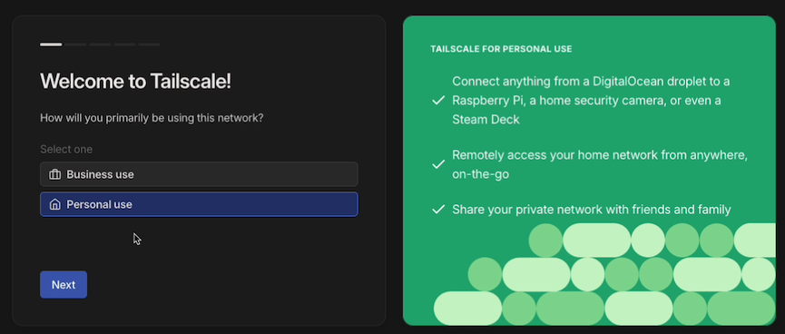

# Basic Tailscale Setup

These instructions will help you create a Tailnet and connect an Unraid server. Once finished, you should be able to
connect to the following services via the Tailscale IP / MagicDNS name of the Unraid server:

- WebGUI
- File shares (SMB/NFS)
- SSH
- Bridge mode Docker containers (default or custom bridge networks)

!!! note
    Docker containers running on ipvlan/macvlan networks (e.g., br0) cannot be accessed via the Tailscale IP for the
    Unraid server. To connect to these containers, you should either [configure a subnet router](advanced-tailscale-settings.md) or 
    [add Tailscale to the container](connecting-docker-containers.md).

## Create a Tailnet

1.  Go to [Tailscale](https://www.tailscale.com) and click the **Get Started** button.

    

2.  Select an identity provider and log in.
   
    

3.  Select either **Business use** or **Personal use**.

    

4.  Follow the provided instructions to install Tailscale on a client device (phone/laptop/etc.).

    

5.  Once you have installed Tailscale on the device, it will appear on the screen.

    

## Install the Unraid Tailscale Plugin

1.  Log in to the Unraid server and switch to the **Apps** tab.
2.  Search for **Tailscale**.
3.  Install **Tailscale (Plugin)**.

    

4.  Click **Done** once the window shows that Tailscale has been installed.

    

5.  Switch to the **Settings** tab, then click on **Tailscale**.

    

6.  Click **Reauthenticate**.

    

7.  Click **Connect**.

    

8.  After the connection is complete, the browser will redirect to the Tailscale admin console, which should show both
    devices are connected.

    
